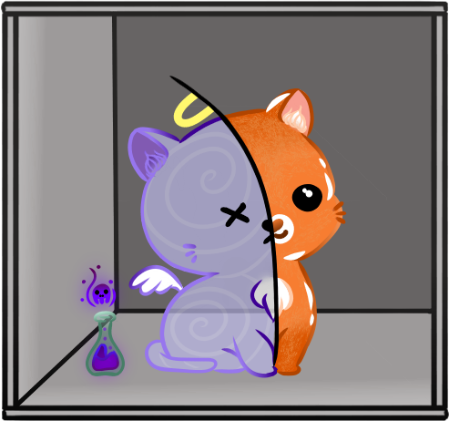

# QuSZIT
{: .fs-9 }

Üdvözlünk a SZIT kvantumalgoritmusokkal foglalkozó csoportjának a honlapján!
{: .fs-6 .fw-300 }

[Első lépések](./bevezeto){: .btn .btn-primary .fs-5 .mb-4 .mb-md-0 .mr-4 }
[Kapcsolat](./kapcsolat){: .btn .fs-5 .mb-4 .mb-md-0 }

---

## Hallgatóknak

Szeretettel várunk minden BSc és MSc képzésben részt vevő hallgatót, akár a Műegyetemről,
akár bármely más felsőoktatási intézményből kvantumalgoritmusokkal kapcsolatos szakdolgozat,
diplomaterv vagy TDK dolgozat készítésére. Érdemes megnézni az aktuális [témakiírásainkat](./temak).
